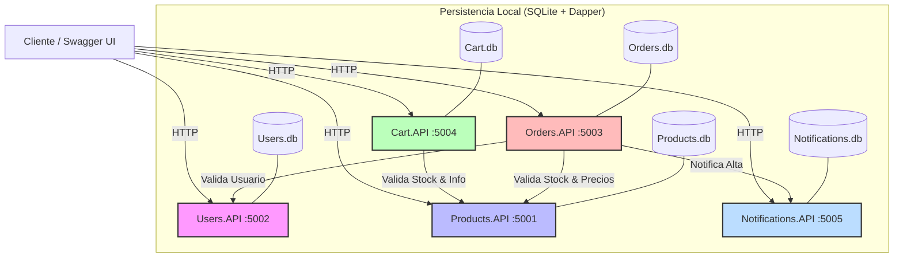

# E-Commerce Microservices - Grupo 18

## 📖 1. Descripción del Proyecto
Este proyecto es un sistema de **E-Commerce** hecho con **C# y .NET 8** para la materia **"Construcción de Aplicaciones Informáticas"**.

La solución está dividida en **5 microservicios**, donde cada uno se encarga de una parte distinta del sistema. Cuando un servicio necesita validar o consultar información de otro, se comunican entre sí por HTTP.

Además, todas las APIs tienen:

- **Swagger** para probar endpoints
- **manejo de errores** con códigos propios
- **logs** para registrar lo que pasa
- **Correlation ID** para seguir una solicitud
- **health checks** para ver el estado del servicio

---

## 📐 2. Diagrama de Arquitectura
El siguiente diagrama muestra los microservicios del sistema y cómo se relacionan entre sí. Las operaciones de escritura (`POST`, `PUT`, `DELETE`) también quedan registradas para auditoría.



---

## 🔌 3. Puertos y accesos principales

Cada microservicio corre en un puerto distinto:

| Microservicio | URL Base Local | Endpoint Swagger | Endpoint Salud (JSON) | Dashboard Monitoreo (UI) |
| :--- | :--- | :--- | :--- | :--- |
| **`Products.API`** | `http://localhost:5001` | `/swagger` | `/health` | `/health-ui` |
| **`Users.API`** | `http://localhost:5002` | `/swagger` | `/health` | `/health-ui` |
| **`Orders.API`** | `http://localhost:5003` | `/swagger` | `/health` | `/health-ui` |
| **`Cart.API`** | `http://localhost:5004` | `/swagger` | `/health` | `/health-ui` |
| **`Notifications.API`** | `http://localhost:5005` | `/swagger` | `/health` | `/health-ui` |

---

## ⚙️ 4. Funcionalidades comunes a todas las APIs

### 4.1. Logging con Serilog
Cada API guarda logs en dos lugares:

* **Consola:** para ver rápidamente lo que está pasando mientras el servicio está corriendo.
* **Archivo (`logs/audit.log`):** para guardar los accesos HTTP de forma estructurada y poder revisarlos después.

En esos logs se puede ver, por ejemplo:

- qué servicio respondió
- qué endpoint se llamó
- qué método HTTP se usó
- qué código de estado devolvió
- cuánto tardó
- qué `CorrelationId` tuvo la solicitud

### 4.2. Auditoría de operaciones de escritura
Las solicitudes `POST`, `PUT` y `DELETE` pasan por un middleware de auditoría.

Ese middleware registra:

- método HTTP
- ruta
- código de estado
- body recibido
- body devuelto

Esto sirve para revisar operaciones importantes como altas, modificaciones y eliminaciones.

### 4.3. Correlation ID
Cada request usa un `X-Correlation-Id`.

Ese identificador sirve para:

- seguir una solicitud de punta a punta
- relacionar logs entre distintos microservicios
- incluir el mismo identificador en respuestas de error

Por ejemplo, si `Orders.API` llama a `Products.API`, ese mismo identificador viaja entre ambos servicios.

### 4.4. Health Checks
Cada microservicio tiene endpoints para consultar su estado:

- `/health`
- `/health/ready`
- `/health/live`
- `/health-ui`

Esto permite verificar si el servicio está funcionando y si está listo para recibir solicitudes.

---

## 🚀 5. Instrucciones de Ejecución

Para iniciar el ecosistema completo localmente:

### Prerrequisitos
* Tener instalado [.NET SDK 8](https://dotnet.microsoft.com/download/dotnet/8.0).

### Paso 1: Restaurar y Compilar la Solución
Desde la raíz de la solución, ejecuta en tu terminal:
```bash
dotnet restore ECommerce.Services.G18.sln
dotnet build ECommerce.Services.G18.sln
```

### Paso 2: Iniciar los Microservicios
Abrir 5 terminales, una por cada proyecto, y ejecutar:
```bash
# Terminal 1
cd Products.API
dotnet run

# Terminal 2
cd ../Users.API
dotnet run

# Terminal 3
cd ../Orders.API
dotnet run

# Terminal 4
cd ../Cart.API
dotnet run

# Terminal 5
cd ../Notifications.API
dotnet run
```
*Las bases de datos SQLite locales se crean e inicializan automáticamente la primera vez que se levantan los servicios.*

---

## 📋 6. Catálogo de errores de negocio
Cuando ocurre un error, las APIs devuelven una respuesta con un formato uniforme y con un código propio para identificar el problema.

* **Products.API:**
  * `PRD-001` (404): Producto no encontrado.
  * `PRD-002` (400): Datos del producto inválidos.
  * `PRD-003` (409): Nombre de producto duplicado en categoría.
  * `PRD-004` (409): Producto con órdenes activas (no eliminable).
* **Users.API:**
  * `USR-001` (409): Email ya registrado.
  * `USR-002` (400): Datos de registro inválidos.
  * `USR-003` (401): Credenciales incorrectas.
  * `USR-004` (403): Usuario bloqueado por superar límite de intentos fallidos.
  * `USR-005` (403): Usuario bloqueado por seguridad/fraude.
* **Orders.API:**
  * `ORD-001` (404): Orden no encontrada.
  * `ORD-002` (400): Datos de orden inválidos.
  * `ORD-003` (404): Usuario no encontrado al crear la orden.
  * `ORD-004` (404): Producto no encontrado al crear la orden.
  * `ORD-005` (422): Stock insuficiente para procesar uno o más ítems.
  * `ORD-006` (409): Transición de estado de orden inválida.
* **Cart.API:**
  * `CRT-001` (404): Carrito no encontrado.
  * `CRT-002` (404): Producto no encontrado al agregar al carrito.
  * `CRT-003` (422): Stock insuficiente para agregar al carrito.
  * `CRT-004` (400): Cantidad inválida (menor o igual a cero).
* **Notifications.API:**
  * `NTF-001` (404): Usuario no encontrado al enviar notificación.
  * `NTF-002` (400): Datos de la notificación inválidos (formato o tipo incorrecto).
  * `NTF-003` (404): Notificaciones no encontradas para el usuario.
